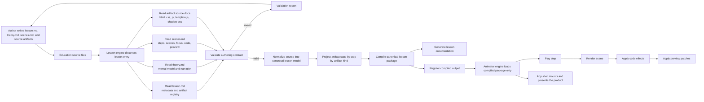

# Lesson Architecture Flow

This diagram shows how the lesson system should work end to end.

It separates the authoring source, the compiler, the runtime, and the app shell.

## Flow

## How The Flow Works

1. The author writes lesson content in source files.
2. The lesson engine discovers the lesson entry and reads the source documents.
3. The lesson engine validates the lesson contract before it does any compilation work.
4. If validation fails, it returns a report and the author fixes the source.
5. If validation passes, the engine normalizes the content into a canonical lesson model.
6. The engine projects each artifact through the lesson steps and builds step-by-step state.
7. The engine compiles a stable lesson package.
8. The engine generates documentation as a derived output.
9. The animator engine consumes only the compiled package, never the raw source.
10. The app shell mounts the animator and presents the product to the user.

## What Each Layer Owns

- `education/` writes source content only.
- `system/lesson-engine/` validates, normalizes, projects, compiles, and writes documentation to `system/lesson-engine/output/`.
- `system/foundation/` provides shared frontmatter and markdown primitives.
- `animator-engine/` replays the compiled lesson package.
- `app/` mounts the runtime and presents the final product shell.

## Key Rules

- Source files are not runtime state.
- Education is source-only.
- The compiler owns per-lesson translation logic.
- Generated docs are derived, not hand-edited, and live under `system/lesson-engine/output/`.
- Validation happens before compilation.
- The compiled lesson package is the only truth the animator needs.
- The runtime never reparses raw markdown to decide lesson meaning.
