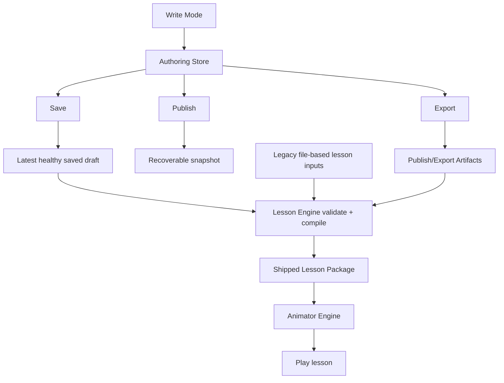

# Lesson Architecture

This file defines the live repo-local lesson architecture contract.

It exists because the mounted reusable architecture docs are read-only in this repo and may still contain migration-era file-first examples. This file is the local operational truth for lesson authoring.

## 1. Canonical Model

The lesson system now has three distinct truths:

1. `Authoring Store`
   - the draft truth for in-progress lessons
   - owned by Write Mode
2. `Shipped Lesson Package`
   - the runtime truth used by the animator
   - produced by the lesson engine
3. `Publish/Export Artifacts`
   - filesystem materialization such as `product/education/lessons/**/source/lesson.script.md`
   - optional during day-to-day authoring

The authoring flow is UI-first.
The runtime flow is compiled-package-first.
Filesystem lesson files are off the critical path for creating and editing drafts.

## 2. Live End-To-End Flow

## 3. Boundary Ownership

- `product/app/` owns the browser shell
- `system/author-lessons/` owns Write Mode and the authoring store bridge
- `system/lesson-engine/` owns validation, normalization, projection, and compilation
- `system/animator-engine/` owns playback of the compiled lesson package
- `product/education/` holds shipped lesson materialization and migration compatibility inputs

## 4. Save, Play, Publish, Export

- `Save`
  - persist draft content to the authoring store
- `Play`
  - compile from the latest healthy saved draft
  - fail closed to the shipped lesson package when the draft is unhealthy
- `Publish`
  - create an explicit recoverable snapshot and, when requested by future workflow, drive shipped output creation
- `Export`
  - materialize filesystem-facing lesson files such as `lesson.script.md`

These actions must never collapse into one ambiguous button contract.

## 5. Draft And Runtime Labels

The repo uses one explicit vocabulary:

- `Draft Saved`
- `Unsaved Changes`
- `Playable Draft`
- `Broken Draft Fallback`
- `Published Lesson`
- `No Draft`
- `Authoring Store`
- `Shipped Lesson Package`
- `Publish/Export Artifacts`

## 6. Filesystem Posture

Filesystem source remains useful, but it is no longer the live default for authoring.

- a new lesson can start entirely from the UI
- no pre-existing folder or source scaffold is required to begin authoring
- shipped files under `product/education/lessons/**/source/` remain valid publish/export targets
- legacy split files remain valid import inputs during migration
- the repo must not describe `lesson.md`, `scenes.md`, `theory.md`, or `artifacts/` as the preferred day-to-day authoring path

## 7. Migration Posture

The system is intentionally migrating without breaking shipped lesson compatibility.

- existing shipped lessons remain playable
- legacy file-based lessons remain importable
- UI-first authoring is the preferred path for new work
- publish/export keeps the repository compatible with shipped source materialization
