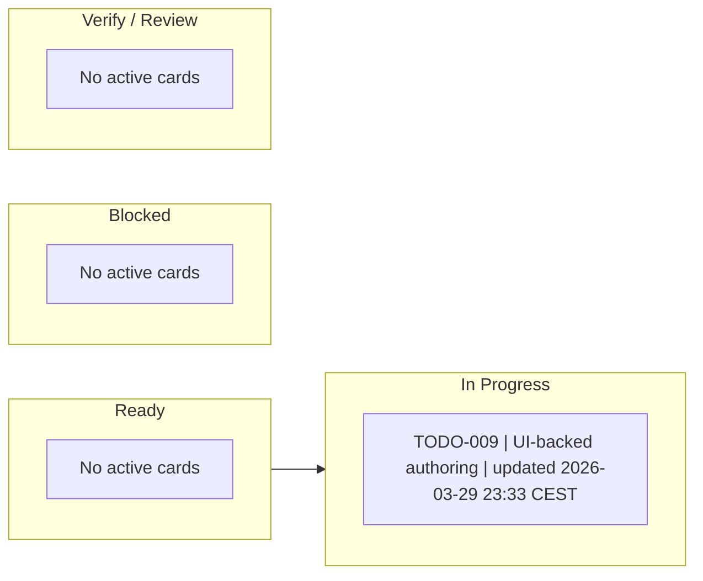

# ACTIVE Board

Visual live board for currently active work across `TODO.md` and `BUGS.md`.

## Rules

- mirror only active items from `TODO.md` and `BUGS.md`
- every card must reference the canonical queue item `id`
- update this board in the same change where queue status changes
- closed items leave this board and move to evidence, not to a fake done column
- card labels should stay short and include the latest meaningful timestamp

Recommended card format:

- `TODO-001 | short label | updated 2026-03-27 21:14 CET`
- `BUG-003 | short label | updated 2026-03-27 21:18 CET`

## Board

