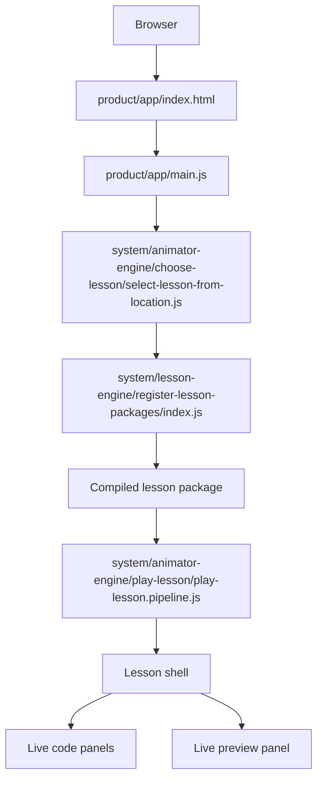

# Step By Step Animator

Step By Step Animator is an interactive lesson engine for HTML, CSS, and JavaScript tutorials that feel like watching a developer work live over screen share.

## Where To Start

- `AGENTS.md` defines the operational contract for work in this repo.
- `.agents/README.md` maps the visible project workspace and local memory.
- `.agents/.rules/AGENTS.md` is the mounted copy of the reusable `.agents` project from the upstream `agent-governance` repo. If it is missing in a fresh clone, run `git submodule update --init --recursive`.
- `.agents/management/TIMELINE.md` defines the timestamp and estimation law.
- `.agents/management/ACTIVE.md` mirrors the current active task and bug board.
- `.agents/business-logic/README.md` defines the plain-language business meaning.
- `.agents/business-logic/content/LessonAuthoringRules.md` is the only canonical user-facing guide for composing a lesson.
- `product/app/index.html` and `product/app/main.js` are the live app entry points.
- `product/education/lessons/01-build-sidebar/source/lesson.script.md` is the default shipped lesson source for the cold-start experience.
- `system/lesson-engine/register-lesson-packages/index.js` registers the live lesson set and declares the default lesson id.

## Repository Map

### Canonical Live Shape

The live repo is organized around these boundaries:

- `product/` is the product surface
  - `product/app/` is the canonical browser shell and Vite root
  - `product/education/` holds shipped lesson sources plus publish/export and migration compatibility material; it is not the live draft-authoring path
- `system/` is the runtime boundary
  - `system/author-lessons/` owns Write Mode and the browser-backed authoring store; this is the live day-to-day authoring path
  - `system/lesson-engine/` compiles lesson drafts or shipped lesson source into the canonical lesson package and writes derived docs to `system/lesson-engine/output/`
  - `system/animator-engine/` plays compiled lesson packages
- `system/foundation/` contains shared frontmatter and markdown primitives
- `system/lesson-engine/output/` holds derived output

### Governance And Documentation

- `.agents/` contains the visible project workspace and local memory
- `.agents/.rules/` contains the mounted reusable `.agents` project
- `.agents/README.md` gives the project map and required questions in one place
- `.agents/management/TODO.md`, `BUGS.md`, `ACTIVE.md`, and `TIMELINE.md` capture active work and queue discipline
- `.agents/management/evidence/CHANGELOG.md` captures closed history
- `.agents/management/evidence/RELEASE_CHECKLIST.md` captures release readiness
- `.agents/language-specific/README.md` captures repo-local language and framework overlays
- `.agents/business-logic/README.md` captures the user and software perspectives
- `.agents/review/REVIEWS.md` captures active review findings
- `AGENTS.md` is the canonical operational contract for the repo
- `README.md` is the human-friendly start-here document

### Tests And Tooling

- `tests/` contains the contract, flow, and browser smoke validation harness
- `merge-files.sh` creates the merged repository snapshot
- implementation and bugfix closure in this repo is: validate, run `./merge-files.sh .`, commit, then push
- `vite.config.js` configures the Vite build

### Local Working Directories And Mounted Dependencies

- `dist/` is the build output directory
- `node_modules/` contains installed dependencies
- `.agents/.rules/vendor/agent-governance/` is the mounted upstream rules submodule
- `step-by-step-animator.txt` is the merged snapshot and working backup

### Git Metadata

- `.git/` is repository metadata and is intentionally not part of the product surface

## Install

```bash
git clone --recurse-submodules <repo-url>
cd step-by-step-animator
npm install
```

If the repo was already cloned without submodules, recover the mounted rules tree first:

```bash
git submodule update --init --recursive
```

`npm install` and the canonical repo commands also re-check the mounted `.agents/.rules` tree before running.

## Run Locally

Start the dev server:

```bash
npm run dev
```

Then open the app in your browser:

- `http://localhost:5173/`
- `http://localhost:5173/content/lesson`

Vite is rooted at `product/app/`, so the canonical shell is served from the server root.

## Application Flow



Authoring and playback are separate on purpose:

- day-to-day authoring flow is `Write Mode -> Authoring Store -> Lesson Engine -> Play`
- shipped compatibility and publish/export flow is `product/education/lessons/<lesson-slug>/source/ -> Lesson Engine -> Compiled lesson package`

Published lesson files still live here:

- `product/education/lessons/<lesson-slug>/source/`
- `system/lesson-engine/`
- `system/lesson-engine/output/`
- `system/animator-engine/`
- `product/app/`

## Available Commands

```bash
npm run dev
npm run build
npm run preview
npm test
npm run validate:lessons
npm run sync:lesson-documents
```

- `npm run build` creates a production bundle with Vite
- `npm run preview` serves the production build locally
- `npm test` runs the contract, flow, and smoke tests
- `npm run validate:lessons` validates the shipped lesson source material
- `npm run sync:lesson-documents` regenerates lesson documents under `system/lesson-engine/output/`

## Lesson Drafts, Shipped Files, And Migration

Normal lesson authoring starts in Write Mode.

For the author-facing content rules, use only:

```txt
.agents/business-logic/content/LessonAuthoringRules.md
```

That document is the canonical lesson composition guide. Architecture docs and migration docs support engineering work, but they do not replace the author-facing rules for how to compose a lesson.

- the canonical authored document shape is still `lesson.script.md`
- during normal authoring that document lives in the browser-backed authoring store, not in a required filesystem scaffold
- a new lesson can start from the UI without pre-existing folders or source files
- `Save` persists the draft to the authoring store, mirrors the same `lesson.script.md` source into a browser backup when that boundary is available, and for healthy paired shipped drafts keeps the paired repo `lesson.script.md` materialization in sync
- `Play` compiles from the latest healthy saved draft
- `Publish` stores a recoverable authoring snapshot
- `Export` materializes a `lesson.script.md` file when you explicitly want filesystem output for custom or unpaired drafts

Shipped lesson files live under:

```txt
product/education/lessons/<lesson-slug>/source/
```

When a lesson is materialized to the repository, the shipped shape is:

- `lesson.script.md`
- optional `theory.md`
- optional `assets/`

`lesson.script.md` keeps step, scene, narration, and one-or-more `Show Code` snapshots in one scrollable file. The legacy split source (`lesson.md`, `scenes.md`, `artifacts/`) remains only as an import/migration bridge. Filesystem lesson sources are off the critical path for creating and editing drafts, but they remain valid import inputs and publish/export outputs while migration stays in flight.

## Authoring Workspace

The browser app now exposes a dedicated authoring workspace at `/content/lesson`.

- Write Mode is the default authoring surface
- entering `/content/lesson` opens a full-width lesson collection view with search, lesson cards, and direct edit entry instead of implicitly dropping into whichever paired draft happened to sort first
- the authoring store is the draft source of truth for in-progress lessons
- shipped lesson source is loaded as importable or pairable input, not as the required starting point for new authoring
- editable drafts live in browser-side SQLite persistence backed by IndexedDB, with an exact `lesson.script.md` mirror stored in browser-owned backup files for recovery
- authors can create, open, update, duplicate, delete, publish snapshots, and export `lesson.script.md`
- Write Mode opens on the first real `# Step:` block instead of the raw frontmatter contract
- `/content/lesson` acts like a CMS index: list all lessons, filter them fast, click a lesson card to open the editor, or start a new custom draft without hunting through `More`
- once a lesson is open, the left rail remains as a compact secondary browser for fast switching
- metadata stays in the `Metadata` drawer while the main editor focuses on the lesson body
- the workspace is split into `Outline | Editor | Inspector`, with live preview, compile state, validation, snapshots, and step-level artifact diff kept in the right column
- `CodeMirror` owns the canonical `lesson.script.md` editing surface in the center panel
- `BlockNote` is lazy-loaded only inside the metadata drawer for prose-rich fields such as `lessonIntro` and `goal.imageCaption`
- `CKEditor 5` is not part of the shipped authoring path because no unresolved WYSIWYG requirement remains
- the editor remains DSL-aware, with slash-triggered block insertion and inline `+ Insert Block` authoring
- drafts still compile back through the same lesson engine contract before save and publish
- the normal player prefers the latest healthy saved paired draft for the selected shipped lesson; if the SQLite snapshot is missing it can recover from the mirrored `lesson.script.md` backup, and broken saved drafts still fail closed back to the shipped lesson package
- a healthy saved custom draft with no shipped filesystem package can also be selected directly by `?lesson=<draft-lesson-id>` and played as a `Playable Draft`
- entering `/content/lesson/<shipped-lesson-id>` opens that lesson's paired draft instead of whichever draft happened to be edited most recently
- Write Mode keeps the browser location aligned with `/content/lesson` or `/content/lesson/<lesson-id>` so refresh and back-to-player stay on the current lesson path
- paired drafts refresh from shipped lesson source updates until the operator edits them; edited paired drafts stay preserved
- the authoring state model is explicit: `Draft Saved`, `Unsaved Changes`, `Playable Draft`, `Broken Draft Fallback`, `Published Lesson`, and `No Draft`
- `Save` persists draft content to SQLite, mirrors the exact `lesson.script.md` into a browser backup so the draft can be restored if the SQLite snapshot disappears, and when the saved draft is healthy plus paired to a shipped lesson path it also updates the paired repo `product/education/lessons/<lesson-slug>/source/lesson.script.md`
- `More -> Sync paired repo files` walks every shipped lesson in the current browser store, ensures the paired draft exists, refreshes the browser backup, and syncs the paired repo `lesson.script.md` without needing fake content edits
- `More -> Reset paired draft` overwrites the current paired SQLite draft with the current shipped lesson source, refreshes the browser backup, and leaves the repo file unchanged when it already matches shipped content
- `Play` uses the latest healthy saved draft, falls back to the mirrored `lesson.script.md` backup when the SQLite snapshot is unavailable, and still fails closed to the shipped lesson package when the draft content is unhealthy
- `Publish` stores a recoverable version snapshot in SQLite and marks the lesson as a `Published Lesson` inside the authoring lifecycle
- `Export` downloads the current `lesson.script.md`; filesystem materialization for custom or unpaired drafts stays optional for day-to-day authoring and required only when you explicitly want publish/export artifacts
- a restored version snapshot should return the draft to a recoverable saved state instead of acting like a second source of truth
- legacy `?workspace=authoring` links still resolve as a compatibility fallback, but they are no longer the canonical operator path

## Notes

- Do not edit generated output by hand.
- The canonical app entry is `product/app/main.js`, and the canonical shell file is `product/app/index.html`.
