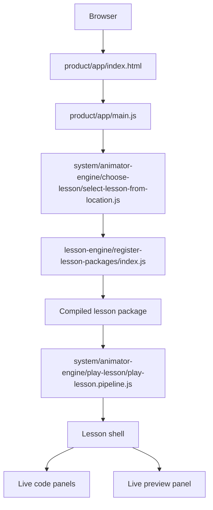

# Step By Step Animator

Step By Step Animator is an interactive lesson engine for HTML, CSS, and JavaScript tutorials that feel like watching a developer work live over screen share.

## Where To Start

- `AGENTS.md` defines the operational contract for work in this repo.
- `.agents/architecture/ARCHITECTURE.md` defines the repo-specific architecture.
- `product/app/index.html` and `product/app/main.js` are the live app entry points.
- `product/education/lessons/02-build-top-navigation/source/lesson.md` is the current pilot lesson source.
- `lesson-engine/register-lesson-packages/index.js` registers the live lesson set.

## Repository Map

### Canonical Live Shape

The live repo is organized around these boundaries:

- `product/` is the product surface
  - `product/app/` is the canonical browser shell and Vite root
  - `product/education/` is source-only lesson authoring
- `lesson-engine/` translates lesson source into compiled lesson data and generated documents
- `system/` is the runtime boundary
  - `system/animator-engine/` plays compiled lesson packages
  - `system/foundation/` is reserved for shared low-level primitives
- `generated/` holds derived output

### Governance And Documentation

- `.agents/` contains planning, evidence, architecture, authoring, and review records
- `AGENTS.md` is the canonical operational contract for the repo
- `README.md` is the human-friendly start-here document

### Tests And Tooling

- `tests/` contains the Node test harness
- `scripts/` contains helper scripts
- `merge-files.sh` creates the merged repository snapshot
- `vite.config.js` configures the Vite build

### Local Working Directories

- `dist/` is the build output directory
- `node_modules/` contains installed dependencies
- `step-by-step-animator.txt` is the merged snapshot and working backup

### Git Metadata

- `.git/` is repository metadata and is intentionally not part of the product surface

## Install

```bash
npm install
```

## Run Locally

Start the dev server:

```bash
npm run dev
```

Then open the app in your browser:

- `http://localhost:5173/`

Vite is rooted at `product/app/`, so the canonical shell is served from the server root.

## Application Flow



Source authoring flows in the opposite direction:

- `product/education/lessons/<lesson-slug>/source/`
- `lesson-engine/`
- generated lesson documents
- `system/animator-engine/`
- `product/app/`

## Available Commands

```bash
npm run dev
npm run build
npm run preview
npm test
npm run validate:lessons
npm run sync:lesson-documents
```

- `npm run build` creates a production bundle with Vite
- `npm run preview` serves the production build locally
- `npm test` runs the contract, flow, and smoke tests
- `npm run validate:lessons` validates the shipped source-only lessons
- `npm run sync:lesson-documents` regenerates lesson documents from source

## Lesson Source

Source-only lessons live under:

```txt
product/education/lessons/<lesson-slug>/source/
```

Each lesson is authored through:

- `lesson.md`
- `scenes.md`
- optional `theory.md`
- `artifacts/`
- `assets/`

## Notes

- Do not edit generated output by hand.
- The canonical app entry is `product/app/main.js`, and the canonical shell file is `product/app/index.html`.
